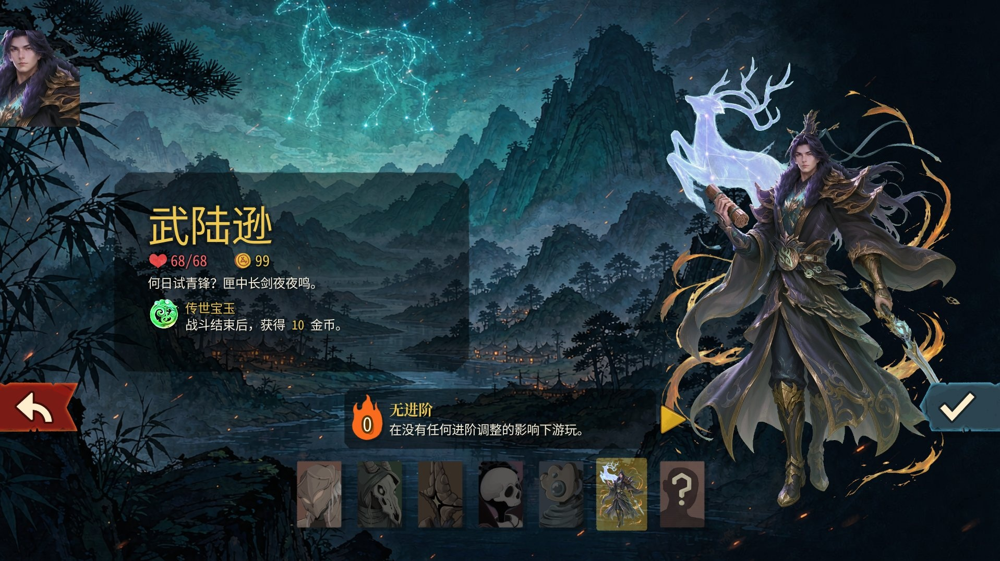

# 三国杀·杀戮尖塔2（SGSModV3）

> 一个将三国杀元素带入《杀戮尖塔 2》的角色 + 卡牌 MOD  
> 作者：苦苦林  
> 当前版本：0.9.0

---

## 简介

《三国杀·杀戮尖塔2》为《杀戮尖塔 2》带来了一位全新可玩角色、一套三国杀主题卡牌池，以及原创先古之民事件「蒲元」。

你可以在塔中打出熟悉的「杀」「闪」「桃」，可以打出高爆发的火焰伤害，又或者是持续输出的多段雷电伤害，亦或是以苦肉为核心的自伤体系。

发动儒贤后，用一摸一，搭配立牧实现无限？不过，万一无限中断，要面临下一回合被跳过的惨剧。

---

## 新增内容

### 角色
- **武陆逊**
  - 初始生命 68，金币 99
  - 翠绿主题卡框
  - 起始卡组：杀、闪、桃、雷杀、儒贤、无中生有

### 卡牌（共 52 张）
顺手牵羊、无中生有、万箭齐发、南蛮入侵、决斗、火杀、雷杀、火攻、业炎、天劫、闪电、遗计、驭雳等等

### 遗物（9 件）
包含原创遗物「传世宝玉」等，围绕三国杀机制与属性伤害设计。

### 先古之民事件：蒲元
- 出现在第二层（Hive）
- 50% 概率遇到
- 与蒲元对话后可从 3 件三国主题遗物中挑选一件
- 自定义背景场景

### 属性伤害体系
- **火焰伤害**：高爆发
- **雷电伤害**：多段

### 自伤体系
- 消耗生命值造成高额伤害，配合多种恢复手段保持健康的血线

---

## 运行要求

- 游戏本体：《杀戮尖塔 2》（Slay the Spire 2）
- 依赖 MOD：[STS2-RitsuLib](https://steamcommunity.com/sharedfiles/filedetails/?id=3747602295)
- 最低游戏版本：0.107.1

---

## 安装方式

1. 订阅本 MOD
2. 确保已订阅 **STS2-RitsuLib**
3. 启动游戏，在 Mod 管理器中启用「三国杀·杀戮尖塔2」
4. 新建一局即可看到角色「武陆逊」

---

## 已知说明

- 当前版本为 0.9.0，属于公开测试阶段。
- 共 52 张卡牌
- 中英双语已支持，但中文游玩体验更佳

---

## 反馈与更新

如有 bug 或平衡建议，欢迎在创意工坊评论区留言。或者添加QQ2143899688，邮箱mayuchao05@foxmail.com

---

*封面图：角色选择界面「武陆逊」*
